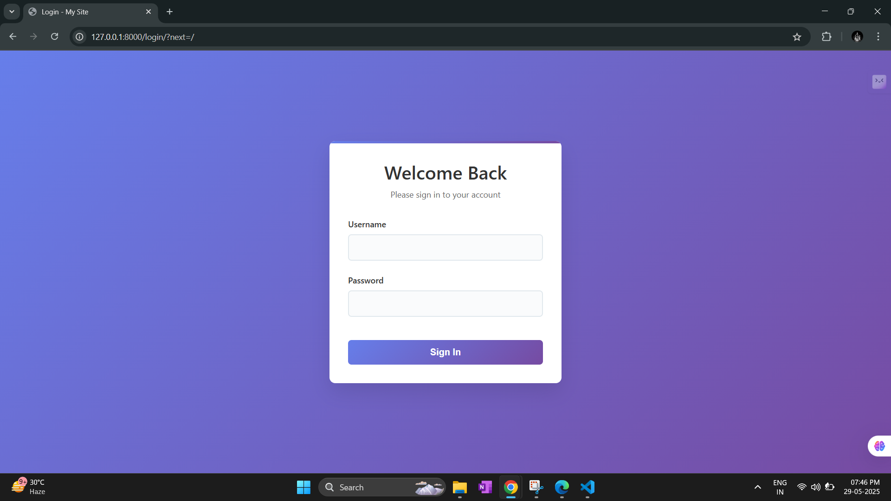
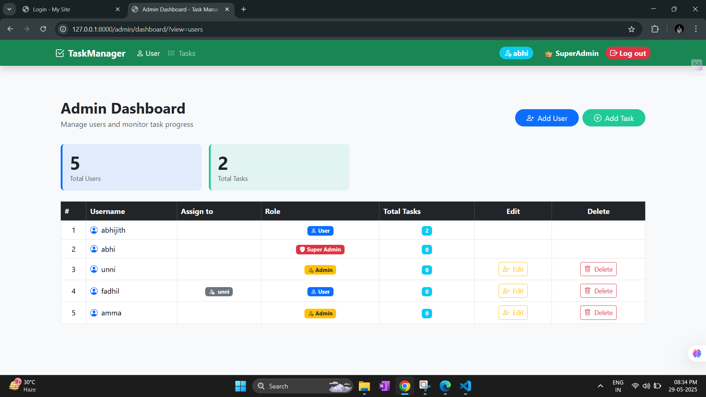
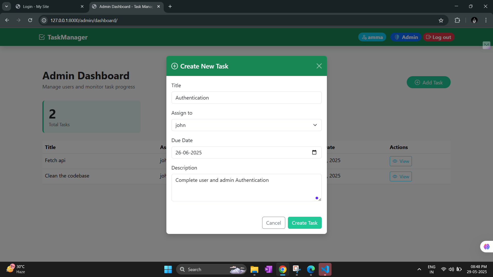
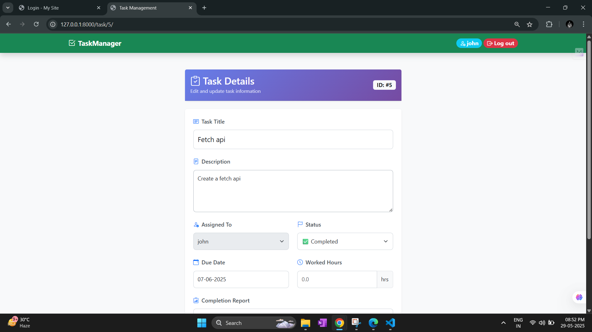

# Task Management API

## Installation & Setup

1. **Clone the repository**
   ```sh
   git clone https://github.com/AbhijithMR-403/task-manager.git
   cd task-manager
   ```

2. **Create and activate a virtual environment**
   ```sh
   python -m venv venv
   venv\Scripts\activate
   ```

3. **Install dependencies**
   ```sh
   pip install -r requirements.txt
   ```

4. **Apply migrations**
   ```sh
   python manage.py migrate
   ```

5. **Create a superuser (admin)**
   ```sh
   python manage.py createsuperuser
   ```
   Follow the prompts to set username, email, and password.

6. **Run the development server**
   ```sh
   python manage.py runserver
   ```

7. **Access the admin panel**
   - Open your browser and go to: [http://127.0.0.1:8000/admin/dashboard/](http://127.0.0.1:8000/admin/dashboard)
   - Log in with the superuser credentials you created.
---


# ✨ Features

## 🔐 1. User Authentication

- **Login URL:** [`http://127.0.0.1:8000/login`](http://127.0.0.1:8000/login)  
- **Redirection after login:**
  - **Admin/SuperAdmin** → `/admin/dashboard`
  - **Regular Users** → `/`
### 


## 2. SuperAdmin Page
- **API Endpoint:** [`http://127.0.0.1:8000/admin/dashboard/`](http://127.0.0.1:8000/admin/dashboard/)
- SuperAdmin can manage all users and all tasks.
### 

## 3. Admin Page
- **API Endpoint:** [`http://127.0.0.1:8000/admin/dashboard/`](http://127.0.0.1:8000/admin/dashboard/)
- Admin can access only the tasks assigned to users under them.
- Cannot set a due date in the past.
- Only users assigned to the admin will be listed in the "Assign To" dropdown.
### 

## 4. User's Task detail page
- **API Endpoint:** [`hhttp://127.0.0.1:8000/task/<int:id>`](http://127.0.0.1:8000/task/<int:id>)
- Users can update only the following fields:
  - Status
  - Worked hours
  - Completion report
### 